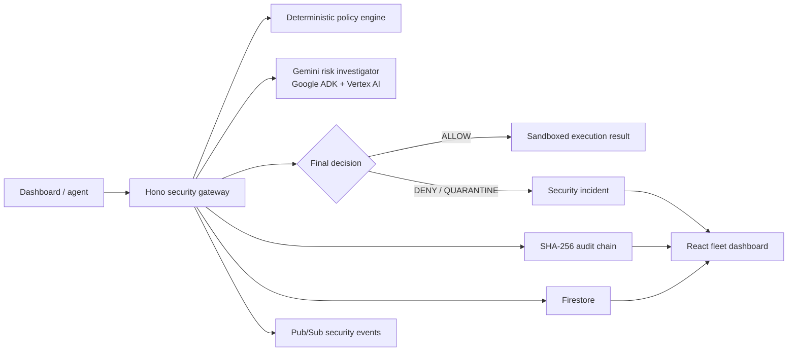

# Aegis Fleet

**Aegis Fleet is a zero-trust control plane for enterprise AI agents.** It
intercepts every privileged action, checks deterministic policy, adds Gemini
contextual risk analysis, creates tamper-evident audit evidence, and can
quarantine a compromised agent before it reaches a protected tool.

**Live demo:** [aegis-fleet-723957597435.europe-west1.run.app](https://aegis-fleet-723957597435.europe-west1.run.app)

## The problem

Enterprise agents increasingly initiate payments, access customer data, and
operate infrastructure. Their actions can be unsafe even when the request
looks syntactically valid: a payment can exceed its delegated authority, a
tool call can target a sensitive resource, or untrusted prompt content can try
to redirect an agent.

Aegis Fleet makes this risk visible and enforceable at a single gateway rather
than trusting each individual agent implementation.

## What it does

- Registers agent identity, ownership, trust tier, capabilities, allowed tools,
  and policy assignments.
- Evaluates a **deterministic deny-wins policy** before execution.
- Uses a Gemini 3.5 Flash risk investigator through Google ADK and Vertex AI as an
  advisory contextual-risk layer.
- Fails closed if advisory model analysis is unavailable: an otherwise allowed
  action is denied; an existing deterministic denial is preserved.
- Detects prompt-injection indicators and increases behavioral risk.
- Automatically quarantines an agent at critical behavioral risk.
- Creates incidents for denied and quarantined actions.
- Builds a SHA-256 hash chain for audit events and verifies the chain in the
  dashboard.
- Writes agents, actions, incidents, and audit events to Firestore.
- Publishes typed security events to Pub/Sub.

## Live demo scenarios

Open the [dashboard](https://aegis-fleet-723957597435.europe-west1.run.app)
and run the scenario buttons in this order.

| Scenario | Expected result | Evidence shown |
| --- | --- | --- |
| Safe payment | Allowed and completed | Low-risk decision and audit event |
| Overspend | Denied with HTTP 403 | High-severity incident and policy reasons |
| Compromised support agent | Quarantined with HTTP 403 | Critical incident, risk score 100, agent status changes to `QUARANTINED` |

The deployed service was smoke-tested after the latest release: the safe
payment completed, the overspend returned a clean `403 DENY`, the compromised
agent was quarantined, and the audit verifier reported a valid hash chain.

## Architecture



### Decision model

1. Validate the action request with Zod.
2. Resolve the agent manifest and evaluate hard policy rules.
3. Ask Gemini for a schema-validated risk assessment.
4. Apply deterministic final rules:
   - An explicit policy denial always wins.
   - An advisory score of 85 or higher denies an otherwise allowed action.
   - Prompt-injection evidence adds behavioral risk; critical risk quarantines
     the agent.
   - An unavailable assessor never opens a path: allowed actions are denied
     fail-closed, while deterministic denials still return their correct 403.
5. Persist the action, incident when applicable, audit event, and security
   event before returning the decision.

Gemini is advisory only. It cannot directly execute tools or override a hard
policy denial.

## Example policy controls

The built-in procurement policy demonstrates three levels of authority:

- Payments above **$5,000** are denied.
- Payments above **$500** or to an unapproved vendor require escalation.
- Valid small payments to approved vendors are allowed.

Every agent is also constrained by its declared tool allowlist and capability
allowlist. A support agent, for example, cannot call a payroll-record action
because that capability is not present in its manifest.

## Stack

- **TypeScript**, Node.js 24, pnpm workspaces, ESM
- **API:** Hono, Zod
- **UI:** React, Vite
- **Agent intelligence:** Google ADK, Gemini 3.5 Flash on Vertex AI
- **Cloud:** Cloud Run, Firestore, Pub/Sub, Cloud Build, Artifact Registry
- **Tests:** Vitest

## Repository layout

```text
apps/
  api/                 Hono gateway, risk investigator, persistence, events
  web/                 React dashboard
packages/
  contracts/           Shared Zod schemas and domain contracts
  policy/              Deterministic deny-wins policy engine
Dockerfile             Multi-stage Cloud Run container image
```

## Run locally

### Prerequisites

- Node.js 24+
- pnpm 11+
- A Google Cloud project with billing enabled when using Vertex AI, Firestore,
  and Pub/Sub

Install dependencies and start the API and dashboard:

```bash
pnpm install
pnpm dev
```

The API uses port `8787`; Vite proxies `/api` and `/health` to it during local
development.

Create an ignored `.env` file from the example:

```bash
cp .env.example .env
```

Required cloud configuration:

```dotenv
GOOGLE_CLOUD_PROJECT=your-project-id
GOOGLE_CLOUD_LOCATION=global
GOOGLE_GENAI_USE_VERTEXAI=true
AEGIS_GEMINI_MODEL=gemini-3.5-flash
FIRESTORE_DATABASE_ID=aegis-hackathon
PUBSUB_TOPIC=aegis-security-events
```

For local Vertex AI credentials, authenticate with Application Default
Credentials:

```bash
gcloud auth application-default login
gcloud auth application-default set-quota-project your-project-id
```

Never commit `.env` or credentials.

## Verify locally

```bash
pnpm test
pnpm typecheck
pnpm build
docker build --tag aegis-fleet:local .
docker run --rm -p 8080:8080 \
  -e GOOGLE_CLOUD_PROJECT=your-project-id \
  -e GOOGLE_CLOUD_LOCATION=europe-west1 \
  -e GOOGLE_GENAI_USE_VERTEXAI=true \
  -e FIRESTORE_DATABASE_ID=aegis-hackathon \
  -e PUBSUB_TOPIC=aegis-security-events \
  aegis-fleet:local
```

In another terminal:

```bash
curl http://localhost:8080/health
```

## Deploy to Cloud Run

The project is designed to run with a dedicated user-managed service account,
not the default Compute Engine account. Grant that account only:

- `roles/aiplatform.user`
- `roles/datastore.user`
- `roles/pubsub.publisher`

The deployer also needs `roles/iam.serviceAccountUser` on that runtime account;
the Cloud Run service agent needs `roles/iam.serviceAccountTokenCreator` on it.

From the repository root:

```bash
gcloud run deploy aegis-fleet --source . --region=europe-west1 --allow-unauthenticated --service-account="aegis-fleet-run@YOUR_PROJECT_ID.iam.gserviceaccount.com" --set-env-vars="GOOGLE_CLOUD_PROJECT=YOUR_PROJECT_ID,GOOGLE_CLOUD_LOCATION=global,GOOGLE_GENAI_USE_VERTEXAI=true,AEGIS_GEMINI_MODEL=gemini-3.5-flash,FIRESTORE_DATABASE_ID=aegis-hackathon,PUBSUB_TOPIC=aegis-security-events"
```

See the local, ignored `docs/CLOUD_RUN_DEPLOYMENT.md` runbook for the full
one-time IAM setup and troubleshooting history.

## API quick reference

| Endpoint | Purpose |
| --- | --- |
| `GET /health` | Service health check |
| `GET /api/agents` | Fleet registry with current risk scores |
| `POST /api/gateway/execute` | Evaluate and execute a governed action |
| `GET /api/incidents` | Open security incidents |
| `GET /api/audit` | Hash-chained audit events |
| `GET /api/audit/verify` | Verify audit integrity |
| `POST /api/demo/scenario/safe` | Safe payment demo |
| `POST /api/demo/scenario/overspend` | Overspend denial demo |
| `POST /api/demo/scenario/compromised-agent` | Prompt-injection quarantine demo |
| `POST /api/demo/reset` | Reset in-memory demo state |

## Current scope and production considerations

This is a hackathon security-control-plane prototype. The external action
execution is intentionally simulated; no real payments, infrastructure
changes, or customer-data access occur. The public dashboard is appropriate
for a demo but should sit behind authentication and authorization in a
production deployment.

Firestore receives durable security records. The dashboard’s working fleet
state is intentionally held in the running demo instance, so a Cloud Run
instance restart starts a fresh in-memory view; a production next step is to
hydrate that view from Firestore.

## Submission assets checklist

- [x] Public Cloud Run URL
- [x] Live interactive dashboard
- [x] Gemini/Vertex AI integration
- [x] Firestore persistence and Pub/Sub security events
- [x] Automated tests, typechecking, production build, and Docker smoke test
- [ ] 60–90 second screen-recorded demo
- [ ] Hackathon form: project summary, architecture, and repository URL
- [ ] Screenshots of safe, deny, quarantine, incidents, and valid audit chain

## License

Hackathon prototype — add the submission-required license before public reuse.
